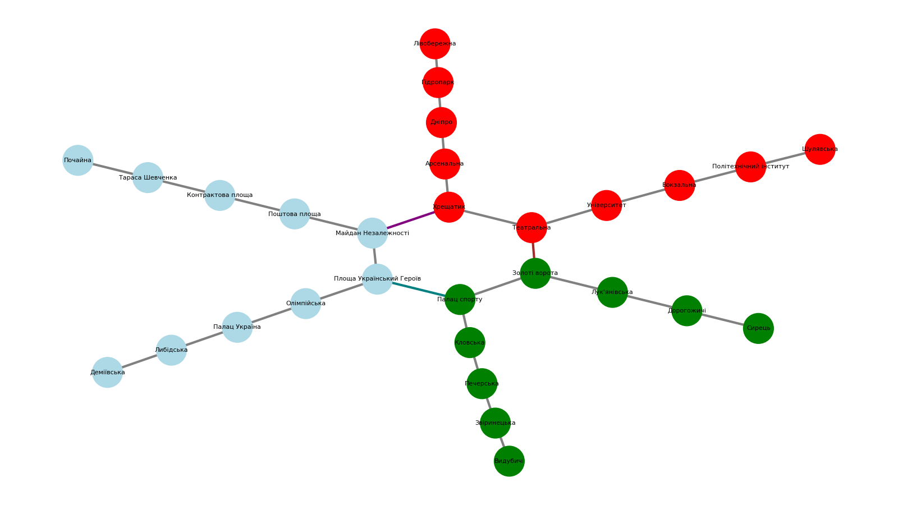

# Algorithms - Homework 6

## Залежності

Для коректної роботи мають бути встановлені наступні пакети Python:
`pip3 install networkx matplotlib scipy`

## Завдання 1

Візуалізація Київського метрополітену (кількість станцій метро зменшена для
кращого сприйняття візуалізакції):

## Завдання 2

Знаходження шляхів між станціями Київського метрополітену з використанням
алгоритмів DFS і BFS дало наступний результат:

DFS Path: Шулявська → Політехнічний інститут → Вокзальна → Університет →
Театральна → Хрещатик → Майдан Незалежності → Площа Український Героїв → Палац
спорту → Кловська

BFS Path: Шулявська → Політехнічний інститут → Вокзальна → Університет →
Театральна → Золоті ворота → Палац спорту → Кловська

Можна помітити, що шлях отриманий за допомогою DFS довший, ніж BFS. Це можна
пояснити різним принципом обходу графів:

- DFS проходить граф в глибину, тобто він переходить до наступної вершини, що ще
  не була відвідана, і продовжує це до тих пір, поки не досягне цілі.
- BFS в свою чергу працює в ширину, обходячи спочатку найближчих сусідів
  поточної вершини, перш ніж переходити до вершин наступного рівня.

BFS гарантовано знаходить найкоротший шлях у невагових графах, оскільки він
досліджує вершини в порядку збільшення їх відстані від початкової точки.

## Завдання 3

За допомогою алгоритму Дейкстри було визначено найкоротший шлях від станції
метро Хрещатик до всіх інших станцій.

До досліджуваного графа було додано ваги, які відображають час в хвилинах між
станціями метро. В реалізації ми припускаємо, що відстань між станціями є
фіксованою - `3 хв`, при цьому час на пересадку між вузловими станціями займає в
середньому `4 хв`.

Було отримано наступні результати:

| Станція                  | хвилини |
| ------------------------ | ------- |
| Хрещатик                 | 0       |
| Театральна               | 3       |
| Арсенальна               | 3       |
| Майдан Незалежності      | 4       |
| Університет              | 6       |
| Дніпро                   | 6       |
| Поштова площа            | 7       |
| Площа Український Героїв | 7       |
| Золоті ворота            | 7       |
| Вокзальна                | 9       |
| Гідропарк                | 9       |
| Контрактова площа        | 10      |
| Олімпійська              | 10      |
| Лук'янівська             | 10      |
| Палац спорту             | 10      |
| Політехнічний інститут   | 12      |
| Лівобережна              | 12      |
| Тараса Шевченка          | 13      |
| Палац Україна            | 13      |
| Дорогожичі               | 13      |
| Кловська                 | 13      |
| Шулявська                | 15      |
| Почайна                  | 16      |
| Либідська                | 16      |
| Сирець                   | 16      |
| Печерська                | 16      |
| Деміївська               | 19      |
| Звіринецька              | 19      |
| Видубичі                 | 22      |
